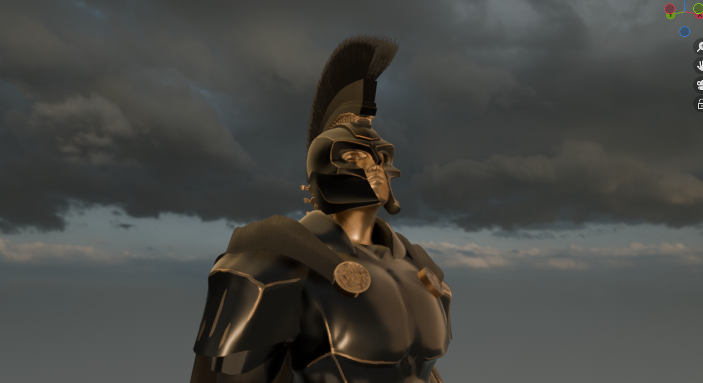
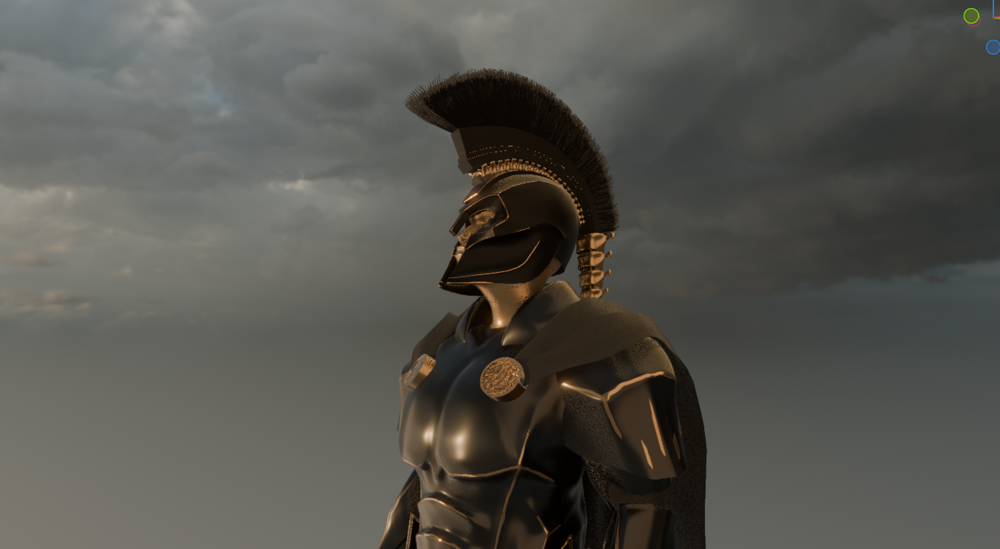

# AGAMEMNON — ARMOR 3D MODEL

## Overview

A full 3D recreation of Agamemnon's armor and character from *The Odyssey*, created in Blender for Hack Club Stardance.

The helmet was recreated closely from Christopher Nolan's film, while the body armor was built from image references and my own interpretation. I also created the character's body, face, hair, cape, sword, materials, and rig from scratch.

## Concept & Reference

I was inspired by Christopher Nolan's *The Odyssey* and wanted to recreate Agamemnon's distinctive armor.

The helmet was modeled to closely match the film design, including the distinctive rear spine-like structure and horsehair crest. The body armor was developed separately using available image references rather than an existing 3D model.

## Modeling & Sculpting

* **Body:** Built the character's body from scratch using blockout references rather than downloading an existing body.
* **Hands:** Modeled using my own hands as anatomical reference.
* **Face:** Sculpted and then optimized into a lower-poly character mesh.
* **Armor:** Modeled the individual armor pieces around the custom-built body.
* **Helmet:** Modeled and refined the helmet with additional sculpting for surface detail.
* **Hair:** Initially experimented with a hair particle system, but converted the hair into lightweight 2D planes to reduce the performance cost.
* **Details:** Added the rear spine-like helmet elements and other small armor components.

## Materials & Textures

Created gold and matte-black materials to match the overall appearance of Agamemnon's armor.

I also baked the textures to make the final materials more compact and efficient.

## Character Setup

After completing the character and armor, I added:

* Custom rigging
* Cape
* Sword
* Final material setup
* Baked textures

## Renders & Media

**Full Project:** [Google Drive](YOUR_GOOGLE_DRIVE_LINK)

*Contains the `.blend` file, screenshots, and project files.*

## Project Info

* **Software:** Blender
* **Type:** 3D Character / Armor
* **Focus:** Modeling, Sculpting, Texturing & Rigging
* **Time Spent:** 45+ hours
* **Status:** Completed
